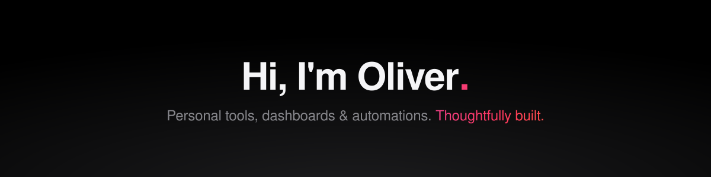

## 🚀 About Me

- 🔭 Currently building **personal productivity tools** — health & life tracking, dashboards, and smart automations
- ⚙️ I love wiring things together: **APIs, workflows, and self-hosted services**
- 🌱 Exploring **cloud-native development** and planning my first open-source releases
- 💬 Ask me about **TypeScript, workflow automation, and serverless**

## 🛠️ Tech Stack

## 📊 GitHub Stats

## 🐍 Contribution Graph

<picture>
  <source media="(prefers-color-scheme: dark)" srcset="https://raw.githubusercontent.com/oliverkrtz/oliverkrtz/output/github-contribution-grid-snake-dark.svg"/>
  <source media="(prefers-color-scheme: light)" srcset="https://raw.githubusercontent.com/oliverkrtz/oliverkrtz/output/github-contribution-grid-snake.svg"/>
  
</picture>

---

*Most of my work lives in private repos — public projects coming soon.* 🚧

